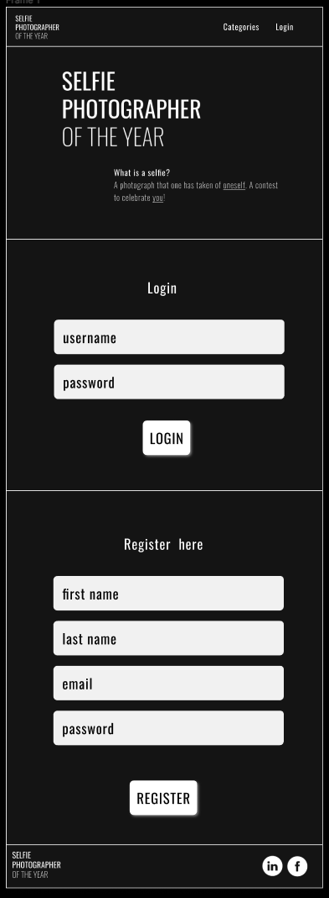
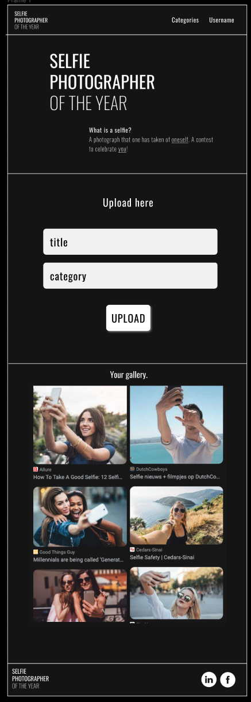

# capstone-selfie-photographer-of-the-year

## Overview

What is your app? Brief description in a couple of sentences.

Selfie Photographer of the Year is a application that hosts a photography contest called Selfie
photographer of the Year. Users can upload photos under their profile into several categories. The
categories will be "Self Portrait, Underwater Selfie, AI Selfie, and Phone Selfie" The photos will
be judged and prizes will be given.

### Problem

Why is your app needed? Background information around any pain points or other reasons.

Photography contests are very popular and some get worldwide recognition. The genre of "Photographer
of the Year", POTY, hosts some of the most popular, including, Wildlife POTY, Landscape POTY, Nature
POTY, Underwater POTY, Bird POTY, Close Up POTY, etc... The novel idea of Selfie POTY is my own and
could be a very popular genre type that includes not only professional photographers but anyone with
a camera "phone". The pain points could include scaling, finding users, finding sponsors for prizes,
overall exposure and of course building a platform that will host all the images.

### User Profile

Who will use your app? How will they use it? Any special considerations that your app must take into
account.

Users will be anyone who enjoys photography. They could be novices or professionals. There must be a
profile for each user and a database to host the images.

### Features

List the functionality that your app will include. These can be written as user stories or
descriptions with related details. Do not describe _how_ these features are implemented, only _what_
needs to be implemented.

Selfie POTY will be a full stack application that host users and their images into a database. The
users will be able to upload one image per category. Each image uploaded will have a category
associated with it which can be displayed in the recent upload gallery. There will also be a like
button for users to use on other images uploaded by other users. There must be a backend database to
host all the images.

## Implementation

### Tech Stack

List technologies that will be used in your app, including any libraries to save time or provide
more functionality. Be sure to research any potential limitations.

I will use React, Express, cors, MySql, node.js, Sass, multer, path, axios, react-router-dom,
FileUpload, Knex

### APIs

List any external sources of data that will be used in your app.

I will build my own api.

### Sitemap

List the pages of your app with brief descriptions. You can show this visually, or write it out.

I am going to build a SPA with three pages. The home page is where the recent uploads will be
displayed and the categories will be described. There will be login/register page for new or current
users to login or register.There will also be a profile page to show the user its photos in a
gallery.

Components 
{
    Header,
    Footer,
    Hero,
    Gallery,
    Categories,
    Login,
    Register,
    Upload,
}

### Mockups

Provide visuals of your app's screens. You can use tools like Figma or pictures of hand-drawn
sketches.

### Data

Describe your data and the relationships between them. You can show this visually using diagrams, or
write it out.

My data will consist of a users table and images table. I should have a 1 to many database structure
with users being the one and the images being many. Each user will have a first_name, last_name, password, email and id. 

Each image will have an image_id, user_id, filename, and category.

### Endpoints

List endpoints that your server will implement, including HTTP methods, parameters, and example
responses.

{ 
    "/" homepage,  
    GET all images from images table,
        { 
            "id": "1", 
            "image": "filename", 
            "categories": "underwater",
            "timestamp": "date-submitted" 
        },
    Response returns 404 if the not images found,
    Response returns 200 if successful  
}
{
    "/login" login,
    PUT a new user,
        {
            "user_id: "1",
            "user_firstname": "Nate",
            "user_lastname": "Paradiso",
            "user_email": "nate@gmail.com",
            "user_password": "123459"
        }
    Response returns 404 if user ID is not found,
    Response returns 200 if successful with the JSON object that was created 
}
{
    "/login/user:Id",
    GET a user,
        {
            "id: "1",
            "user_id": "1", 
            "user_firstname": "Nate",
            "image": "filename", 
            "categories": "underwater",
            "timestamp": "date-submitted" 
        }
    Response returns 404 if the Id is not found,
    Response returns 200 if successful  
}
{
    "/login/user:Id/upload",
    PUT a image,
        {
            "id": "1", 
            "user_id": "1", 
            "categories": "underwater",
            "title": "title of image"
        }
    Response returns 400 if unsuccessful because of missing properties in the request body,
    Response returns 400 if the user_id value does not exist in the user table,
    Response returns 200 if successful
}

### Auth

Does your project include any login or user profile functionality? If so, describe how
authentication/authorization will be implemented.

Not sure how to do this.

## Roadmap

Scope your project as a sprint. Break down the tasks that will need to be completed and map out
timeframes for implementation. Think about what you can reasonably complete before the due date. The
more detail you provide, the easier it will be to build.

Sprint 1
<> 
Create react app --> 
Setup express app --> 
Setup MySql db --> 
Build tables and migration and seeds --> 
Build endpoints in express --> 
/>

Sprint 2
<>
Build Header component -->
Build Footer component -->
Build Categories component -->
Build Hero component -->
Build Login component -->
Build Register component -->
Build UserUpload component -->
Build UserGallery component -->
/>

Sprint 3
<>
Build react routes -->
Test components -->
/>

## Nice-to-haves

Your project will be marked based on what you committed to in the above document. Under
nice-to-haves, you can list any additional features you may complete if you have extra time, or
after finishing.

I would like to classify each images using this api. https://docs.imagga.com/?node#tags.

A like button would be nice under each uploaded image. 

I would like to have users and login using cookie parser.

User authentication would be nice. 

Limit uploads to 1 image per category.

Delete an image. 

Edit image metadata.

